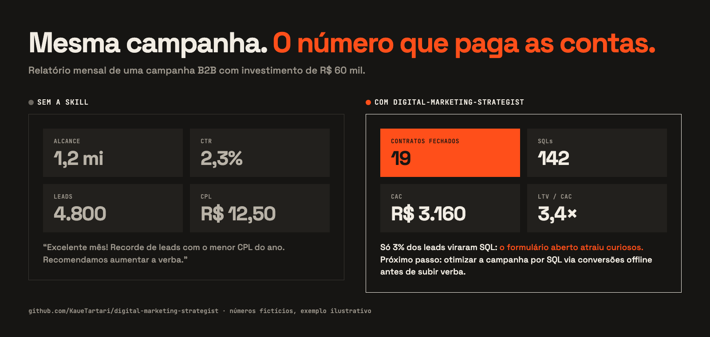

# digital-marketing-strategist

**Uma skill que transforma o Claude num estrategista sênior de mídia paga e performance.**

Peça um relatório ou um plano de campanha para uma IA e ela celebra alcance, CTR e "recorde de leads". O cliente, porém, paga as contas com contratos e margem, e o algoritmo continua otimizando para curiosos porque ninguém devolveu a venda para a plataforma.

Esta skill ensina o Claude a planejar, estruturar e medir mídia como uma agência orientada a receita: do See-Think-Do-Care ao envio de conversões offline, da Conversions API ao teste de incrementalidade.



<sub>Números fictícios. O relatório da esquerda reproduz de propósito o foco em métricas de vaidade; o da direita segue a lógica da skill. O código da imagem está em [`docs/src/`](docs/src/).</sub>

---

## O que ela faz

- **Planejamento estratégico:** roteiro em 10 etapas, OKRs com conta de trás para frente (meta de receita → verba necessária), SLA entre marketing e vendas, ICP, análise competitiva e matriz de mensagem.
- **Funil See-Think-Do-Care:** canais, mensagens, ofertas e KPIs por nível de intenção, com proporção Paid/Owned/Earned como ponto de partida.
- **B2B e ABM:** LinkedIn Ads por cargo e empresa, Google Search com negativas robustas, níveis de ABM, remarketing de 90 dias em três fases e otimização por SQL em vez de formulário.
- **B2C e e-commerce:** Performance Max por margem, Shopping, campanhas Advantage+ da Meta com creative-first, TikTok, anúncios para WhatsApp e negócios locais.
- **Lances por valor:** receita, margem (POAS) ou pLTV enviados pelo servidor, com ROAS de equilíbrio calculado.
- **Engenharia de sinais:** GTM server-side, Meta Conversions API com deduplicação correta, parâmetros de correspondência (e quais **não** levam hash), Google Enhanced Conversions, GCLID/GBRAID/WBRAID no CRM, estornos e Consent Mode com LGPD.
- **Mensuração unificada:** MMM (Meridian, Robyn), testes de incrementalidade (Conversion Lift, GeoLift, holdout), atribuição tática e quando usar cada um.
- **Entregas de agência prontas:** planejamento completo, estrutura de campanha, copies por ângulo com limites de caracteres, briefing criativo, relatório para cliente e auditoria priorizada.

Com limites claros: separa benchmark verificável de heurística, não inventa resultado de case, avisa quando nomes e limites das plataformas podem ter mudado e respeita LGPD, CDC, CONAR e políticas de anúncios.

## Instalação

### Claude Code

```bash
git clone https://github.com/KaueTartari/digital-marketing-strategist.git
cp -r digital-marketing-strategist/digital-marketing-strategist ~/.claude/skills/
```

Para usar só em um projeto, copie para `.claude/skills/` dentro dele. A skill é acionada sozinha quando o pedido envolve mídia paga, rastreamento ou mensuração, ou manualmente com `/digital-marketing-strategist`.

### Claude.ai (app e web)

1. Compacte a pasta `digital-marketing-strategist/` (a que contém o `SKILL.md`) em um `.zip`.
2. Vá em **Configurações → Capacidades → Skills** e faça o upload.

### Qualquer outra IA

Copie o conteúdo do [`SKILL.md`](digital-marketing-strategist/SKILL.md) (sem o bloco `---` do topo) e cole nas instruções do projeto, junto com os arquivos de `references/` que fizerem sentido.

## Estrutura

```
digital-marketing-strategist/
├── digital-marketing-strategist/
│   ├── SKILL.md                      ← princípios, fluxo, formatos de entrega e KPIs
│   └── references/
│       ├── planejamento-stdc.md      ← 10 etapas, OKRs, SLA, ICP, matriz de mensagem, STDC, verba
│       ├── b2b-abm.md                ← pipeline, LinkedIn, Search B2B, ABM, remarketing, offline
│       ├── b2c-ecommerce.md          ← PMax, Shopping, Advantage+, TikTok, WhatsApp, VBB, POAS
│       ├── copy-criativos.md         ← limites por plataforma, ângulos, briefing, roteiro, políticas
│       ├── sinais-rastreamento.md    ← server-side, CAPI, EMQ, Enhanced Conversions, consentimento
│       └── mensuracao-umm.md         ← fórmulas, MMM, incrementalidade, atribuição, relatório
├── docs/                             ← imagem e código da comparação
├── README.md
└── LICENSE
```

## Contribuindo

Uma plataforma mudou um recurso ou limite? Tem um playbook que funciona e não está aqui? Abra uma issue ou mande um pull request.

## Créditos e licença

Criada por **[Kauê Tartari](https://github.com/KaueTartari)**, com auxílio do Claude (Anthropic) na redação.

Distribuída sob a licença [Creative Commons Atribuição 4.0 Internacional (CC BY 4.0)](LICENSE). Você pode usar, adaptar e redistribuir, inclusive comercialmente, desde que dê o crédito.
